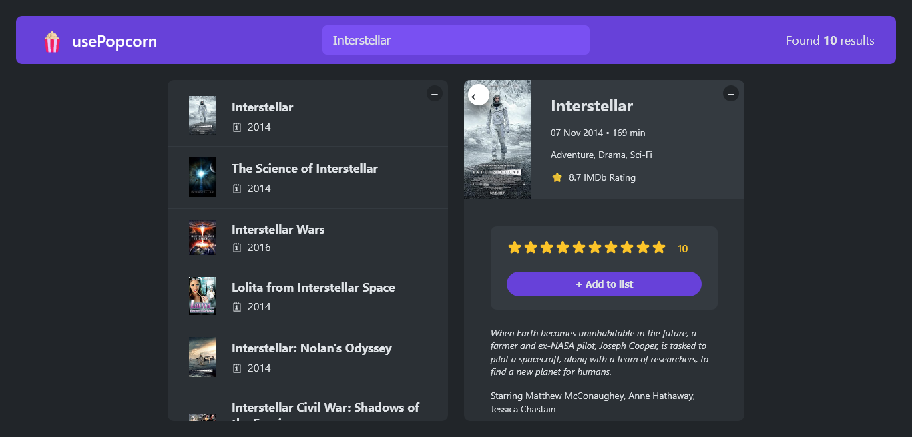
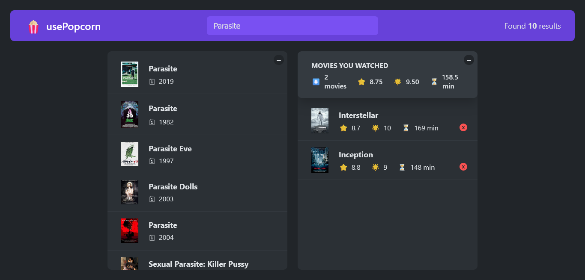

# 🍿 usePopcorn 🎬

This is a movie rating app built during [**"The Ultimate React Course 2025: React, Next.js, Redux & More"**](https://www.udemy.com/course/the-ultimate-react-course/) by **Jonas Schmedtmann**. The app allows users to search for movies, view details, rate them, and manage a personal watchlist.

---

## ✨ Features

- **Search for movies** using the OMDb API.
- **View movie details** including the plot, cast, genre, and IMDb rating.
- **Add movies** to a personal watchlist and remove them.
- **Rate watched movies** and store your personal rating.
- **Calculate average ratings** for movies on your watchlist.

---

## 🚀 How to Use

1.  **Go to the site:** [usePopcorn](https://Darkoray.github.io/usePopcorn/).
2.  **Search for a movie:** Type the movie title into the search bar.
3.  **Select a movie:** Click on a movie from the search results to see its details.
4.  **Add to watchlist:** On the movie details page, click the "Add to list" button.
5.  **Rate a movie:** After adding a movie to the watchlist, you can select a star rating.
6.  **Remove from watchlist:** Click the "X" button next to a movie in your watched list.

---

## 🛠️ Technologies Used

- **React** (Functional Components & Hooks like `useState`, `useEffect`, `useRef`).
- **JavaScript (ES6+)**.
- **CSS3**.
- **HTML5**.
- **OMDb API** for movie data.

---

## 🌟 UI

These are reusable components that handle the user interface.

- `ErrorMessage.js`: Displays an error message to the user.
- `Loader.js`: Shows a loading indicator while data is being fetched.
- `StarRating.js`: A customizable star rating component.

## 🧩 Components

These components manage specific parts of the application's functionality.

- `App.js`: The main application component that manages overall state, including search results and watched movies.
- `Logo.js`: Displays the application logo and title.
- `Search.js`: The input field for searching movies.
- `NumResult.js`: Displays the number of search results.
- `Box.js`: A reusable container for displaying content.
- `Movie.js`: Displays a single movie in the search results list.
- `MovieDetails.js`: Shows detailed information for a selected movie.
- `WatchedMovie.js`: Displays a single movie from the user's watched list.
- `WatchedSummery.js`: Calculates and displays average ratings and runtime for the watched movies.

## 🖼️ Layout

These components define the structure of the application.

- `Main.js`: The main layout component that divides the screen into two sections.
- `Navbar.js`: Contains the search bar and application title.
- `MovieList.js`: Renders the list of movies from search results.
- `WatchedMovieList.js`: Renders the list of movies the user has watched.
- `config.js`: Contains the API key for the OMDb API.

## 🎣 Hooks

These hooks encapsulate reusable logic.

- `useKey.js`: A hook to handle keyboard events, like closing a movie with the "Escape" key.
- `useLocalStorageState.js`: A hook for synchronizing state with local storage.
- `useMovies.js`: A hook for fetching movie data from the OMDb API.

---




---

## 📂 Project Structure

```
usepopcorn/
├─ image/
│  └─ README/
│     ├─ 1754161145808.png
│     └─ 1754161151114.png
├─ public/
│  ├─ favicon.ico
│  ├─ index.html
│  ├─ logo192.png
│  ├─ logo512.png
│  ├─ manifest.json
│  └─ robots.txt
├─ src/
│  ├─ components/
│  │  ├─ Box.js
│  │  ├─ Logo.js
│  │  ├─ NumResult.js
│  │  └─ Search.js
│  ├─ hooks/
│  │  ├─ useKey.js
│  │  ├─ useLocalStorageState.js
│  │  └─ useMovies.js
│  ├─ layouts/
│  │  ├─ MovieDetails/
│  │  │  ├─ MovieDetails.js
│  │  │  ├─ WatchedMovie.js
│  │  │  ├─ WatchedMovieList.js
│  │  │  └─ WatchedSummery.js
│  │  ├─ MovieList/
│  │  │  ├─ Movie.js
│  │  │  └─ MovieList.js
│  │  ├─ App.js
│  │  ├─ config.js
│  │  ├─ Main.js
│  │  └─ Navbar.js
│  ├─ ui/
│  │  ├─ ErrorMessage.js
│  │  ├─ Loader.js
│  │  └─ StarRating.js
│  ├─ index.css
│  └─ index.js
├─ .gitignore
├─ package-lock.json
├─ package.json
└─ README.md
```

---

## 📄 License & Credits

This project is part of a course and is provided for **learning purposes only**.

© by Jonas Schmedtmann. You can use it for your portfolio or learning. Do not use it to teach or redistribute as your own work.
